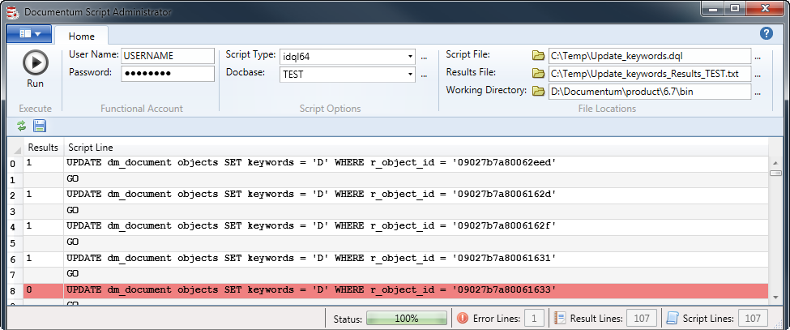

# Documentum Script Administrator

This Documentum scripting tool was created in Microsoft Visual Studio Community 2017 C#/WPF Ribbon. Multiple scripts can be contained in one file then run as one command against the idql32/64. It then refreshes the grid with the results file that is created by the idql tool. It was created to help with scripting Documentum databases. This application must be run on the Documentum Content Server in order to work properly.

<h1 align="center">
  
</h1>

 

## Table of Contents
- <a href="#dependencies">Dependencies</a>
- <a href="#glossary-of-terms">Glossary of Terms</a>
- <a href="#functionality">Functionality</a>

 

## Dependencies
|Software                        |Dependency                 |
|:-------------------------------|:--------------------------|
|[Microsoft Visual Studio Community 2017](https://www.visualstudio.com/vs/whatsnew/)|Solution|
|[Microsoft Ribbon for WPF](https://www.microsoft.com/en-us/download/details.aspx?id=11877)|Project|
|[Microsoft SQL Server CE 3.5](https://www.microsoft.com/en-au/download/details.aspx?id=5783)|Database|
|[SQL Server Compact Toolbox](https://marketplace.visualstudio.com/items?itemName=ErikEJ.SQLServerCompactSQLiteToolbox)|Database|
|[Sandcastle](https://github.com/EWSoftware/SHFB)|API documentation|
|[Log4Net](https://www.nuget.org/packages/log4net/) |Error Logging |
|[Documentum](http://documentum.opentext.com/documentum/)|Script|
|[www.IconArchive.com](http://www.iconarchive.com/show/silk-icons-by-famfamfam.html)|Icons|

 

## Glossary of Terms

| Term                      | Meaning                                                                                  |
|:--------------------------|:-----------------------------------------------------------------------------------------|
|DocScript |Documentum Script Administrator|
|DQL |Documentum Query Language|
|API |Application Programming Interface|
|idql |A scripting application for DQL located in the working directory on the content server| 
|iapi |A scripting application for API located in the working directory on the content server|

 

## Functionality
Listed below is the detailed functionality of this application and its components.  

## Main Form
###	Run
* This button will first copy the script from the script file directory to the working directory.  Then it will execute the script file.
###	User Name
* This account must be an administrator in Documentum.
###	Password
* The password for the administrator in Documentum
###	Script Type
* This is the type of script you can run.  i.e. idql32.exe for a 32 bit machine and idql64 for a 64 bit machine.
###	Docbase
* A specific docbase must be selected
###	Script File
* This file contains one or more than one script files.  It has to be copied to the working directory to run.
* The script file can not have any spaces in the file name
###	Results File
* This is the file that is created after the script file is run.  Unless the path to this file is indicated the default path is the working directory.
###	Working Directory
* This is the location of the script type e.g. idql64.exe, iapi64.exe

##	Quick Access ToolBar
The following are all functions of the quick access toolbar.
 
###	Refresh
* This refreshes the results column from the results file in the datagrid
### Save
* This saves the grid to a csv file

## Application Menu
The following are all functions of the application menu.
 
###	About
* The about form 
###	How To…
* Opens the as built documentation.
###	API Doc…
* Opens the API documentation.
###	Settings
* All the dropdown lists and default values are stored here and can be edited.
###	Copy
* Copies the command line script
###	Exit
* Closes the application.
